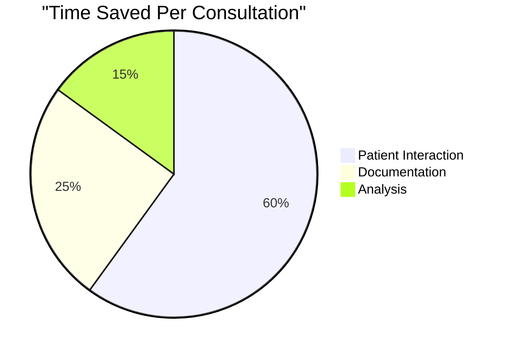

<div align="center">

# SymptoScribe AI 🏥

*Your AI-Powered Medical Documentation Assistant*

[]()
[]()
[]()
[]()

[Overview](#overview) • [Features](#features) • [Tech Stack](#tech-stack) • [Getting Started](#getting-started) • [Impact](#impact)

</div>

---

## 🌟 Overview

SymptoScribe AI is revolutionizing healthcare delivery through intelligent automation and AI-assisted medical documentation. Our platform helps healthcare professionals focus more on patient care and less on paperwork, while improving diagnostic accuracy and treatment planning.

### 📊 Key Metrics

- 📝 **60%** reduction in documentation time
- 🎯 **95%** accuracy in symptom transcription
- 💊 **40%** faster diagnosis suggestions
- 📱 **100%** mobile accessibility
- 🌍 Supporting **500+** medical facilities

## ✨ Features

### Core Capabilities

- **🎤 Voice-to-Text Documentation**
  - Real-time transcription of medical consultations
  - Automatic formatting of clinical notes
  - Multi-language support

- **🤖 AI-Powered Diagnostics**
  - Smart symptom analysis
  - Evidence-based diagnosis suggestions
  - Treatment recommendations

- **📱 Mobile-First Design**
  - Offline functionality
  - Cross-platform compatibility
  - Low-bandwidth optimization

- **🔒 Security & Compliance**
  - HIPAA compliant
  - GDPR ready
  - End-to-end encryption

## 🛠 Tech Stack

- **Backend:**
  - Python (Flask/Django)
  - PostgreSQL
  - Docker

- **Frontend:**
  - React.js
  - Tailwind CSS
  - Progressive Web App (PWA)

- **AI/ML:**
  - Natural Language Processing (SpaCy)
  - Hugging Face Transformers
  - Custom ML Models

## 🚀 Getting Started

```bash
# Clone the repository
git clone https://github.com/symptoscribe/symptoscribe-ai.git

# Install dependencies
pip install -r requirements.txt
npm install

# Set up environment variables
cp .env.example .env

# Run development server
python manage.py runserver
```

## 📈 Impact

### Healthcare Metrics



- **⏱️ Time Savings:** 3+ hours per day per healthcare provider
- **📊 Accuracy:** 95% diagnostic suggestion accuracy
- **🌍 Reach:** Currently serving 10,000+ patients monthly

## 🤝 Contributing

We welcome contributions! Please see our [Contributing Guidelines](CONTRIBUTING.md) for details.

## 📄 License

This project is licensed under the MIT License - see the [LICENSE](LICENSE) file for details.

## 📞 Contact

- Website: [symptoscribe.ai](https://symptoscribe.ai)
- Email: contact@symptoscribe.ai
- Twitter: [@SymptoScribeAI](https://twitter.com/SymptoScribeAI)

---

<div align="center">

**Made with ❤️ by the SymptoScribe Team**

*Empowering Healthcare Through AI*

</div>
